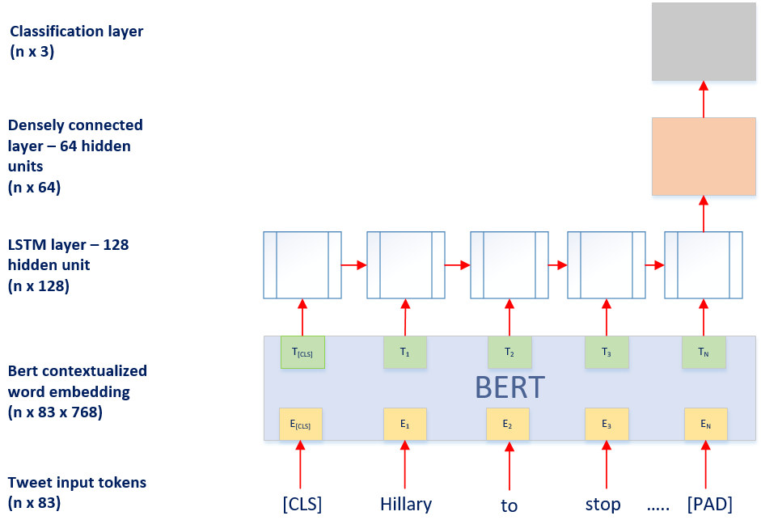

```{r packages, include = FALSE}
library(tidyverse)
library(gridExtra)
library(htmltools)
library(ggthemes)
library(RColorBrewer)
library(png)
library(grid)
library(openxlsx)

options(tinytex.verbose = TRUE)
```

```{r data_import, include = FALSE}
label_levels = c("AGAINST", "NONE", "FAVOR")

# IMPORT
import_topic = function(topic_name){
  tweet_data = read.csv(file = paste0("./final_outputs/", topic_name, "_tweets_v3.csv"), header = FALSE) %>%
    mutate(V1 = 1:n()-1)
  pred_data = read.csv(file = paste0("./final_outputs/", topic_name, "_preds_v3.csv"), header = FALSE)
  true_data = read.csv(file = paste0("./final_outputs/", topic_name, "_true_v3.csv"), header = FALSE)
  names(pred_data) = c("obs_num", "predicted_label")
  names(true_data) = c("obs_num", "true_label")
  names(tweet_data) = c("obs_num", "tweet")

  merged = tweet_data %>%
    merge(pred_data
          , by = "obs_num"
          , all.x = TRUE) %>%
    merge(true_data
          , by = "obs_num"
          , all.x = TRUE) %>%
    mutate(topic = topic_name
           , predicted_label_f = case_when(predicted_label == 0 ~ "AGAINST"
                                         , predicted_label == 1 ~ "NONE"
                                         , predicted_label == 2 ~ "FAVOR"
                                         , TRUE ~ NA_character_) %>% factor(levels = label_levels)
           , true_label_f = case_when(true_label == 0 ~ "AGAINST"
                                    , true_label == 1 ~ "NONE"
                                    , true_label == 2 ~ "FAVOR"
                                    , TRUE ~ NA_character_) %>% factor(levels = label_levels)
    )
  return(merged)
}
abort = import_topic(topic_name = "abort")
atheism = import_topic(topic_name = "atheism")
clim = import_topic(topic_name = "clim")
hil = import_topic(topic_name = "hil")
fem = import_topic(topic_name = "fem")
all_topics = bind_rows(abort, atheism, clim, hil, fem)

# CALCULATE METRICS
metrics = function(y_true, y_pred){
  confusion_matrix = as.matrix(table(Actual = y_true, Predicted = y_pred))
  n = sum(confusion_matrix)
  n_classes = nrow(confusion_matrix)
  correct_byclass = diag(confusion_matrix)  
  instances_byclass = apply(confusion_matrix, 1, sum)
  predictions_byclass = apply(confusion_matrix, 2, sum)

  precision = correct_byclass / predictions_byclass
  recall = correct_byclass / instances_byclass
  f1 = 2 * precision * recall / (precision + recall)

  classification_report = data.frame("Class" = label_levels
                                    , "Precision" = round(precision * 100, 2)
                                    , "Recall" = round(recall * 100, 2)
                                    , "F1 Score" = round(f1 * 100, 2))
  f1_macro = mean(f1)
  f1_macro_custom = mean(f1[c(1,3)])

  metric_list = list()
  metric_list$confusion_matrix = confusion_matrix
  metric_list$classification_report = classification_report
  metric_list$f1_macro = f1_macro
  metric_list$f1_macro_custom = f1_macro_custom

  return(metric_list)
}
abort_metrics = metrics(y_true = abort$true_label_f, y_pred = abort$predicted_label_f)
atheism_metrics = metrics(y_true = atheism$true_label_f, y_pred = atheism$predicted_label_f)
clim_metrics = metrics(y_true = clim$true_label_f, y_pred = clim$predicted_label_f)
hil_metrics = metrics(y_true = hil$true_label_f, y_pred = hil$predicted_label_f)
fem_metrics = metrics(y_true = fem$true_label_f, y_pred = fem$predicted_label_f)
all_topics_metrics = metrics(y_true = all_topics$true_label_f, y_pred = all_topics$predicted_label_f)

# F stats
f_topics = c(atheism_metrics$f1_macro_custom
             , clim_metrics$f1_macro_custom
             , fem_metrics$f1_macro_custom
             , hil_metrics$f1_macro_custom
             , abort_metrics$f1_macro_custom)
f_summary = c(all_topics_metrics$f1_macro_custom
              , mean(f_topics)
              , f_topics)
f_summary = round(f_summary * 100, 2)
names(f_summary) = c("F-microT", "F-macroT"
                     , "Atheism", "Climate Change", "Feminism", "Hillary Clinton", "Abortion")

# Error Analysis
all_topics_errors = all_topics %>%
  filter(predicted_label != true_label) %>%
  select(obs_num, topic, tweet, predicted_label_f, true_label_f)

##################### Use below if needed to export raw errors again #####################
# write.csv(all_topics_errors, file = "./final_outputs/all_topics_errors.csv")
##########################################################################################
all_topics_errors_reviewed = read.xlsx("./final_outputs/all_topics_errors_reviewed.xlsx", sheet = "all_topics_errors")

atheism_errors_annotated = all_topics_errors_reviewed %>%
  filter(topic == "atheism")

atheism_errors_grouped = atheism_errors_annotated %>%
  group_by(true_label_f, issue) %>%
  summarise(count = n())
```

# Introduction

## Background  

Stance classification is a natural language processing (NLP) task that seeks to automatically determine the "stance" of a statement in relation to a "target". The stance the author of that statement can take is either in **favor** of the target, **against** the target, or **neutral** toward the target. A target can be anything, from a proposition to an idea, a person, a political issue, etc. The stance of any statement can be assessed against any target. However, since the statement may not address the target at all, it is possible that the author's stance towards a target of interest cannot be determined. In certain circumstances where the at-issue target is not addressed directly, the stance of a statement can be determined by inference from association with another target.

Given an abundance of online discourse on social media, automatic stance detection of social media content is an appealing task with widespread potential applications. In particular, Twitter is a social media platform with an incredibly fast-paced environment where many tweets are shared back-and-forth addressing a variety of topics and issues. Stance classification of tweets has applications across many domains: marketing industry efforts to measure public opinions on products, political campaign attempts to measure public views on candidates' policies, and efforts by Twitter to identify bad actors (i.e., "trolls"). While there has been significant research in stance classification with respect to debates and online forums, Twitter poses a new challenge as many "tweeters" represent their stance towards a target implicitly and often use figurative language, shorthand, acronyms, or hashtags.   

## Objective  

The objective of this paper is to explore new methodologies for detecting stance of tweets and attempt to design a classification model that outperforms existing models.

# Data, Task, & Evaluation  

We relied on an existing, pre-labeled Twitter dataset that has been analyzed by competitor models against which we can compare our results _(@mohammad-etal-2016-dataset)_. This dataset was originally compiled for the International Workshop on Semantic Evaluation 2016 (SemEval-2016) where it was used in an evaluation exercise, Task 6 _(@mohammad-etal-2016-semeval)_.

The dataset consists of approximately 5,000 tweet-target pairs annotated for both stance and sentiment. The targets may or may not be referred to in the tweets. While sentiment has shown to be a useful input for stance classification, it was not available to competitors at the SemEval-2016 conference. Given this in combination with the fact that pre-labeled sentiment would not be available in a production environment, the sentiment labels were ignored for our classification model (_@sobhani-etal-2016-detecting). _

The process for collecting and annotating these tweets is detailed in _@mohammad-etal-2016-dataset _. The authors queried Twitter for topic-specific hashtags in an effort to collect a full corpus of tweets related to the intended targets. These targets and example topic-specific hashtags are presented in _Table 1_ below:  

| Target | FAVOR | AGAINST |
| :---- | :--: | :--: |
| **Atheism** | _#NoMoreReligions_ | _#GodsWill_ |
| **Climate Change is a Real Concern** | - | _#GlobalWarmingHoax_ |
| **Feminist Movement** | _#INeedFeminismBecause_ | _#FeminismIsAwful_ |
| **Hillary Clinton** | _#GoHillary_ | _#WhyIAmNotVotingForHillary_ |
| **Legalization of Abortion** | _#ProChoice_ | _#PrayToEndAbortion_ |

Table: Target categories with example hastags

After extracting the results, _@mohammad-etal-2016-dataset _ retained only tweets with the query hashtag at the end of the tweet. The query hashtag was then removed in order to exclude obvious clues for the classification task. Note that while this is a necessary step for the NLP task, removal of the query hashtag may actually change the stance of the tweet (e.g. if the hashtag was a negation of the preceding text).  

Tweets were then annotated for stance using CrowdFlower (http://www.CrowdFlower.com), a website for crowd-sourced data annotation, where each tweet was annotated by at least eight reviewers. The raw inter-annotater agreement was 73.1%; however, a cutoff was applied where only tweets with greater than 60% agreement were retained, increasing the average agreement to 81.85%. Lastly, the resulting tweets were split into train and test sets chronologically. (See the **Limitations** section for more on how this process may affect the classifcation task).

Models were trained independently to predict stance for each target separately. Performance was evaluated for each target using a modified F1 score, which took the macro-average of the FAVOR and AGAINST class F1 scores only. This method was chosen to treat the NONE stance as a class that is not of interest (or negative class), though it still will affect the macro-average F1 scores. For evaluation of model performance across all targets, the micro-average of F1 scores was evaluated (referred to as **F-microT**). This was the score used as the official competition metric. Alternatively, the macro-average of the F1 scores can also be calculated (referred to as **F-macroT**) by averaging the modified F1 scores achieved for each target _(@mohammad-etal-2016-semeval)_.

# Related Work  

## Baseline Models  

The baseline model for the SemEval-2016 Task 6 competition was a linear-kernel **Support Vector Machine (SVM)** classifier with three different specifications and features sets used _(@mohammad-etal-2016-semeval)_. The _unigrams_ model created five SVM classifiers (one per target) trained using unigram features. The _N-grams_ model created five SVM classifiers (one per target) trained using word n-grams of 1-, 2-, and 3-gram length and character n-grams of 2-, 3-, 4-, and 5-gram length. The _N-grams-combined_ model implemented one SVM classifier trained on the combined data for all targets, using the same n-gram features as described above.  

SVM was chosen as a baseline since it is effective on text categorization tasks and robust on large feature spaces. _@sobhani-etal-2016-detecting _ expanded on the _N-grams_ model to also include word embeddings and sentiment lexicon features. Note that the word embeddings in this model were trained using the "full corpus" of nearly 2 million tweets extracted by the authors that comprised the original dataset using query hashtags. These additional tweets were not provided with the data. Therefore, the strength of this model may be artificially inflated through the context these word embeddings were able to capture by virtue of being trained with exclusive tweets that align precisely with the task at hand.

## SemEval-2016 Task 6 Competitors  

Several of the competing teams within the SemEval-2016 Task 6 competition took a **neural network** approach to the challenge. _@zarrella-marsh-2016-mitre,_ the winner of the competition, leveraged transfer learning to perform the classification task.  The team sampled 200 million+ relevant tweets to create an auxiliary 'hashtag prediction task', which was used as a projection into a Long Short Term Memory (LSTM) - Recurrent Neural Net (RNN) layer. _@wei-etal-2016-pkudblab _ and _@vijayaraghavan-etal-2016-deepstance _ both implemented convolutional neural networks; however, these models did not achieve the same level of success as _Zarrella and Marsh (2016)_.  

## Subsequent SemEval Progress  

Since Sem-Eval 2016, there have been two additional contributions to this task of note.  Both _@sun-etal-2018-stance _ and _@ijcai2017-557 _ leveraged **neural attention networks** to perform stance classification, with each team achieving higher final F1 scores than the winner of the initial competition.  Although several of the competing teams found effective models, none were able to achieve higher final F1 scores than the improved SVM baseline from _@sobhani-etal-2016-detecting _.  This also holds for _@sun-etal-2018-stance _ and _@ijcai2017-557 _'s work after the conference ended.   

## General State-of-the-Art NLP Methodologies  

Outside the context of SemEval-2016 conference, the BERT language model from _@devlin2018bert _ has achieved state-of-the-art performance on several common natural language processing tasks including question answering, sentiment analysis, and named entity recognition [see _\autoref{fig:bert_by_task}_ in the *Appendix* for model diagrams for BERT, from @devlin2018bert].  

_@mayfield-black-2019-stance _ applied BERT contextualized word embeddings to a stance classification task attempting to predict whether a Wikipedia user preferred to keep or delete a specific post based on their comments.  _@mayfield-black-2019-stance _'s results show that BERT out-performed their baseline classifiers, which used GloVe and Bag-of-Words embeddings as inputs.  

Further, _@ma-unpublished _ experimented with various infrastructures built on top of BERT outputs for a classification task using Twitter data.  The overall goal of _@ma-unpublished _'s experiment was to determine whether a given tweet was 'on-topic' or 'off-topic' in the context of disaster management.  _@ma-unpublished _ found that a bi-directional LSTM taking in the full BERT sequential output outperformed the standard BERT pooled output used for classification tasks.

# Model  

Next, we describe the model we implemented to approach SemEval-2016 Task 6. After reviewing the work performed by contributing members of the competition, we hypothesized that a neural network which effectively captures the context of the limited characters and words contained in a tweet would perform well in classifying stance from Twitter data. Words contained in tweets cannot always be taken at face value. Hashtags, sarcasm, irony, and other forms of rhetoric are frequently found in tweets, and we would want our model to effectively capture these nuances since it contains valuable information about the author's stance.

## Infrastructure  

Given the state-of-the-art performance BERT has seen across many natural language processing tasks, including _@mayfield-black-2019-stance _'s stance classification and _@ma-unpublished _'s classification task leveraging Twitter data, we elected to leverage BERT Base for contextualized word embeddings. Rather than using the pooled output captured by BERT's [CLS] token, our model connects the full sequential output from BERT to a 128-unit LSTM layer.  This infrastructure was motivated by the success of the BERT-LSTM integrated layers in _@ma-unpublished _'s Twitter classification task as well as _Zarrella and Marsh (2016)_'s competition winning model that leveraged an auxiliary 'hashtag prediction task' as a projection into a LSTM-RNN layer.  The LSTM layer output is fed into a densely connected layer consisting of 64 units using a 'relu' activation function and He initialization.  The densely connected layer feeds the classification layer which uses 'softmax' activation to predict the probability of each of the three stance labels in our data set: FAVOR/NONE/AGAINST. Dropout is performed at two points: 1) prior to the LSTM layer and 2) prior to the classification layer.  Refer to _\autoref{fig:model_diagram}_ in the *Appendix* for a diagram of our model infrastructure.  

As previously mentioned, we expect a model that has the capacity to capture the unique rhetoric seen in tweets to perform well in stance classification.  The combined use of BERT with a LSTM layer would provide the infrastructure suitable to capture the nuances of hashtags, sarcasm, and irony frequently used on Twitter.

## Hyperparameter Tuning  

Since independent models were trained for each of the five targets, we tuned the model's hyperparameters on a single target, Hillary Clinton, and then applied the results to the remaining targets. Hillary Clinton was selected because it contained the most consistent balance of classes within both the training and test sets. In addition, its majority class was the AGAINST stance label, which was consistent with all the other topics, excluding Climate Change.  Our overall approach for hyperparameter tuning was trial and error. \autoref{fig:hyperparam_table} below details the hyperparameters we focused on as well as the final value implemented in our models.  

| Hyperparameter | Final Value |
| :------------- | :---------- |
| Learning Rate | 0.001 |
| Epochs | 20 |
| Dropout Rate | 50% |
| Batch Size | 32 |
| # of Bert Fine Tune Layers | 6 layers |
| Tweet Pre-processing | None |

Table: \label{fig:hyperparam_table} Hyperparameters tuned and final values used

Note we ran our model both with tweets pre-processed (all words lower-cased and punctuation and digits removed) as well as without pre-processing.  The model performed consistently better without pre-processing applied, and thus, we elected to train all topic models on the raw tweets.

## Training

As mentioned above, we leveraged a batch size of 32 tweets for training.  Adam optimization with a learning rate of 0.001 was used with categorical cross entropy loss.  We used 20 epochs for training on all topics, except for Climate Change, which had a considerably smaller sample size, and thus required fewer epochs (7 epochs) before overfitting the model to the training data.  Since no development data was provided, we carved out 15% of the training data to use as development data to determine whether we were overfitting during training.  The pre-trained BERT weights were also fine-tuned during training.

# Results  

Our model's results are summarized in the tables below. _\autoref{fig:f1rank_table}_ shows the final ranking of our model in the context of the competing teams in the SemEval-2016 conference, the updated baseline SVM model, and the succeeding work by _@sun-etal-2018-stance _ and _@ijcai2017-557 _. _\autoref{fig:f1all_table}_ shows our F1 scores for each topic in comparison to all teams that achieved a high score in at least 1 topic as well as the updated SVM baseline, _@sun-etal-2018-stance _, and _@ijcai2017-557 _.

| Topic | F1 Score | SemEval-2016 Rank | Overall Rank |
| :--------- | :------: | :---: | :---: |
| F-macroT (All Targets) | 60.88 | 1 | 2 |
| F-microT (All Targets) | 69.72 | 1 | 3 |
| Atheism  | 69.66 | 1 | 2 |
| Hillary  | 64.48 | 2 | 3 |
| Abortion | 64.06 | 1 | 3 |
| Climate  | 48.47 | 3 | 5 |
| Feminism | 57.76 | 2 | 3 |

Table: \label{fig:f1rank_table} Final F1 Scores with ranks  

| Team | F-microT <br> (All Targets) | F-macroT <br> (All Targets) | Atheism | Climate | Feminism | Hillary | Abortion |
| :-------------- | :--------: | :--------: | :----: | :----: | :----: | :----: | :----: |
| Sobhani et. al        | **70.32** | 59.01 | 69.19 | 43.80 | 58.72 | 61.74 | **66.91** |
| Sun et. al            | 69.79 | **61.00** | **70.53** | 49.56 | 57.50 | 61.84 | 66.16 |
| **Dessouky/Spittle**  | 69.72 | 60.88 | 69.66 | 48.47 | 57.76 | 64.48 | 64.06 |
| Du et. al             | 68.79 | 59.56 | 59.77 | **53.59** | 55.77 | 65.38 | 63.72 |
| MITRE                 | 67.82 | 56.03 | 61.47 | 41.63 | **62.09** | 57.67 | 57.28 |
| pkudblab              | 67.33 | 58.57 | 63.34 | 52.69 | 51.33 | 64.41 | 61.09 |
| TakeLab               | 66.83 | 58.00 | 67.25 | 41.25 | 53.01 | **67.12** | 61.38 |
| Majority Class        | 65.22 | 40.09 | 42.11 | 42.12 | 39.10 | 36.83 | 40.30 |
| DeepStance            | 63.54 | 52.86 | 52.90 | 40.40 | 52.34 | 55.35 | 63.32 |
| IDI@NTNU              | 62.47 | 55.08 | 59.59 | 54.86 | 48.59 | 57.89 | 54.47 |

Table: \label{fig:f1all_table} F1 Scores for all state-of-the-art models  

The results in the above tables demonstrate the strength of our model.  When comparing against teams participating in the SemEval-2016 competition (see _Table 3_, column _SemEval-2016 Rank_), we achieved the highest F-microT and F-macroT scores across all targets. We also achieved the top F1 score in the Atheism and Abortion targets, while finishing second in Hillary Clinton and Feminism, and third in Climate Change. When including _@sun-etal-2018-stance _ and _@ijcai2017-557 _'s post-conference contributions as well as the updated SVM baseline, we do not have any top scores (see _Table 3_, column _Overall Rank_).  However, we still achieved the second highest F-macroT score across all targets, trailing _Sun et. al_ by only 0.12 (see _Table 4_). We also achieved the third highest F-microT score, behind _@sun-etal-2018-stance _ and _@sobhani-etal-2016-detecting _.  Note that F-microT score tends to be higher for models that perform better on the majority class, while F-macroT score tends to be higher for models that perform well on all classes. This can be seen in the comparison between the majority classifier's F-microT and F-macroT scores.  The majority classifier scores a 65.22 on F-microT, but only 40.09 on F-macroT.  Our model achieved universally higher results than the majority classifier. See _\autoref{fig:versus_majority}_ within the *Appendix*.  

# Limitations  

While we were able to build an effective model for stance detection, we came across a number of apparent limitations. First, as mentioned within the **Data, Task, and Evaluation** section, the key query hashtags were removed from the training and test data, which would have been incredibly valuable in determining stance in the real world.  Next, the stance labels were highly skewed. _\autoref{fig:data_dst}_ below shows the distribution of the labels for each target. While we allocated higher weights to the minority classes during the training process, our model still proved to be much more effective in predicting the majority class versus the minority classes.

| Target | Total (#) | Train (#) | FAVOR (%) | AGAINST (%) | NONE (%) | Test (#) | FAVOR (%) | AGAINST (%) | NONE (%) |
| :------------- | :-----: | :-----: | :-----: | :-----: | :-----: | :-----: | :-----: | :-----: | :-----: |
| Atheism  | 733 | 513 | 17.9% | 59.3% | 22.8% | 220 | 14.5% | 72.7% | 12.7%|
| Climate  | 564 | 395 | 53.7% | 3.8%  | 42.5% | 169 | 72.8% | 6.5%  | 20.7% |
| Feminism | 949 | 664 | 31.6% | 49.4% | 19.0% | 285 | 20.4% | 64.2% | 15.4% |
| Hillary  | 984 | 689 | 17.1% | 57.0% | 25.8% | 295 | 15.3% | 58.3% | 26.4% |
| Abortion | 933 | 653 | 18.5% | 54.4% | 27.1% | 280 | 16.4% | 57.3% | 18.4% |

Table: \label{fig:data_dst} Data distribution  

In addition, there was a high level of disagreement amongst the label 'encoders', which translates to a higher expected error rate in our model. We can expect our model to struggle classifying the stance of tweets in which humans do not consistently agree. Further, the total number of tweets in our dataset was low for a NLP problem. This may affect the reproducibility of our model results.  Re-running the same model on the identical training and test sets would produce slightly different results, despite fitting the training data to near 100% accuracy.

## Error Analysis  

_\autoref{fig:confusion_matrix}_ in the *Appendix* presents a confusion matrix detailing the distribution of predicted versus true labels for our model. Given that the AGAINST stance label is the majority class, it is no surprise that the largest contributors to errors are false-negative AGAINST observations.  

Errors for target **Atheism** were manually reviewed to better understand the nature of mis-classified tweets. Errors were categorized according to whether the purported true label or the predicted label from our model appeared to be correct (or if neither appeared correct). \autoref{fig:error_analysis} in the *Appendix* shows the results of this error review and annotation.   

It was surprising how many tweets appeared to have been assigned the incorrect true label. To be clear, there is a substantial amount of ambiguity in these tweets (as has been mentioned, there was a high degree of disagreement among encoders), but we will detail different types of mis-labeled tweets to highlight where and how we think encoders were mistaken.  

First and foremost, some tweet true labels were unambiguously incorrect. The below tweet positively discusses the target directly (atheists/atheism) and even uses a hashtag that is clearly opposed to religion (and therefore aligned with atheism), yet the true label was encoded as AGAINST.

> **True Label**: AGAINST | **Predicted**: FAVOR | **Correct**: FAVOR (True label wrong)  
`r atheism_errors_annotated %>% filter(topic == "atheism" & examples == "blatant") %>% select(tweet) %>% str_replace("@", "[AT]")`  

Other true label error examples have common challenges with the tweet text that may have caused some of these errors in annotation. Generally, ambiguous texts suffer from some form of lack of context. _Missing Context_ errors occur when certain tweets reference specific people or things for which the tweet text alone does not fully capture a state of being. The below tweet, for example, references "those quotes" which we do not see. Therefore, we cannot make a judgment as to how "showing 'em the quotes" would align with the target.  

> **True Label**: AGAINST | **Predicted**: FAVOR | **Correct**: NONE (Both wrong)  
`r atheism_errors_annotated %>% filter(topic == "atheism" & examples == "missing_context") %>% select(tweet) %>% str_replace("@", "[AT]")`  

Similarly, _Referential_ errors occur when tweets reference a target other than the target of interest and an unreasonable leap in assumption is made to come to a conclusion on that author's potential stance on the target. This is apparent in the below tweet where the initial query hashtag, which is not presented, could be the point that makes the author's stance clear. However, without it, it is not reasonable to draw the conclusion that celebrating Independence Day and the constitution exhibits a stance against Atheism.  

> **True Label**: AGAINST | **Predicted**: NONE | **Correct**: NONE (True label wrong)  
`r atheism_errors_annotated %>% filter(topic == "atheism" & examples == "referential") %>% select(tweet) %>% str_replace("@", "[AT]")`  

Lastly, a common problem in sentiment analysis is _Sarcasm_. The below two example tweets (which exhibit both mis-labeled data and an error of our model's prediction) are clearly joking/mocking.  

> **True Label**: AGAINST | **Predicted**: FAVOR | **Correct**: FAVOR (True label wrong)  
`r atheism_errors_annotated %>% filter(topic == "atheism" & examples == "sarcasm" & issue == "True label wrong") %>% select(tweet) %>% str_replace("@", "[AT]")`

> **True Label**: AGAINST | **Predicted**: FAVOR | **Correct**: AGAINST (Our model wrong)  
`r atheism_errors_annotated %>% filter(topic == "atheism" & examples == "sarcasm" & issue == "Our model wrong") %>% select(tweet) %>% str_replace("@", "[AT]")`  

This apparent mis-labeling obviously causes some concern about the ability to train a model consistently that performs well on unseen data. However, the majority of instances reviewed where our model made obvious mistakes were clearly incorrect predictions. There were no systematic issues. It is notable that our model made consistent errors across true label categories. Conversely, the annotaters made errors almost exclusively in the majority AGAINST stance label. The AGAINST stance constitutes 73% of test set data observations for the Atheism target, indicating that some amount of the errors may be attributable to fatigue, perhaps, or some factor that causes repeated annotation to lean toward the majority class.  

# Conclusion and Future Work

In this paper, we implement BERT for contextualized word embeddings in a neural network model used to effectively detect stance.  We propose a novel model architecture for use on the SemEval-2016 Task 6 dataset.  While we did not beat the current top score, we obtained results in line with several of the state-of-the-art models. We achieved a F-microT of 69.72 and a F-macroT of 60.88, which ranked 3rd and 2nd, respectively, amongst all contributors to the task. This demonstrates the potential BERT has as a method of obtaining contextualized word embeddings for the purpose of stance classification.

Going forward, there are a couple additional areas in which there is room for improvement.  First, the use of a bidirectional LSTM layer in lieu of the current LSTM layer implemented in our model could be explored.  In addition, the benefits of using BERT Large in the embedding layer in place of BERT Base could be investigated.

Another potential area for improvement is training BERT from scratch rather than leveraging the pre-trained weights and subsequently fine-tuning with the SemEval-2016 Task 6 data.  If a large corpus could be obtained similar to that described in the **Data, Task, and Evaluation** section above, training BERT from scratch would likely result in a significant boost in F1 score. Lastly, given the small data set size and high skewness, putting effort into collecting more data to increase the sample size and balance out the classes would likely benefit the model performance.

# Appendix  

\pagebreak  

```{r bert_by_task_fig, echo = FALSE, fig.height = 4, fig.width = 4, fig.align="center", fig.cap="\\label{fig:bert_by_task}BERT by Task (Source: Devlin et al.)"}
bert_img = readPNG("images/bert_bytask.png")
grid.raster(bert_img)
```

```{r model_diagram_chunk, echo = FALSE, fig.height = 6, fig.width = 6, fig.align="center", fig.cap="\\label{fig:model_diagram}Model Diagram"}
# 
bert_img = readPNG("images/Dessouky_Spittle_Model_Diagram.PNG")
grid.raster(bert_img)
```

| Stance | Precision | Recall | F1 Score |
| :--- | :--: | :--: | :--: |
| AGAINST | 81.73 | 67.55 | 73.97 |
| NONE | 50.34 | 64.78 | 56.65 |
| FAVOR | 60.22 | 71.71 | 65.47 |

Table: \label{fig:classreport_table} Classification Report  

```{r plot_versus_majority, echo = FALSE, fig.height = 4, fig.width = 6, fig.align="center", fig.cap="\\label{fig:versus_majority}Results versus Majority Classifier"}
measure_levels = c("F-microT", "F-macroT", "Atheism", "Climate", "Feminism", "Hillary", "Abortion")

f_data = data.frame("measure" = c("F-microT", "F-macroT", "Atheism", "Climate", "Feminism", "Hillary", "Abortion") %>%
                      factor(levels = measure_levels)
                    , "our_model" = f_summary
                    , "majority_classifer" = c(65.22,	40.092,	42.11,	42.12,	39.1,	36.83,	40.3)
                    ) %>%
  gather(key = "model", value = "value", -measure) %>%
  mutate(custom_color = c(rep(1, 2), rep(3, 5)
                          , rep(2, 2), rep(4, 5)) %>% factor()) %>%
  arrange(custom_color)

paired_palette = brewer.pal(n = 4, name = "Paired")

ggplot(data = f_data) +
  geom_bar(aes(x = measure, y = value, fill = custom_color), colour = "black", stat = "identity", position = "dodge") +
  scale_fill_manual(name = "Model"
                    , breaks = c(1, 2)
                    , labels = c("Dessouky/Spittle", "Majority Classifier")
                    , values = c(paired_palette[2], paired_palette[4], paired_palette[1], paired_palette[3])) +
  labs(x = "Topic/Measure", y = "Score") +
  theme_bw() + theme(axis.text.x = element_text(angle = 45, hjust = 1)
                     , legend.position = "right")
```

```{r confusion_matrix_chunk, echo = FALSE, fig.height = 4, fig.width = 4, fig.align="center", fig.cap="\\label{fig:confusion_matrix}Confusion Matrix"}
# Confusion Plot
ggplot(data =  all_topics %>% group_by(true_label_f, predicted_label_f) %>% summarise(n = n())
       , mapping = aes(x = true_label_f, y = predicted_label_f)) +
  geom_tile(aes(fill = n), colour = "white") +
  geom_text(aes(label = sprintf("%1.0f", n)), vjust = 1) +
  scale_fill_gradient(low = "white", high = "green4") +
  theme_bw() + theme(legend.position = "none") +
  labs(x = "True Label", y = "Predicted Label") +
  scale_y_discrete(limits = rev(label_levels)) +
  scale_x_discrete(limits = rev(label_levels)) +
  labs(caption = "Note: All Topics")
```

```{r error_analysis_chunk, echo = FALSE, fig.height = 4, fig.width = 6, fig.align="center", fig.cap="\\label{fig:error_analysis}Atheism Error Analysis Summary of Issues"}
ggplot(data = atheism_errors_grouped
       , aes(x = true_label_f, y = count, fill = issue)) +
  geom_bar(position = "stack", stat = "identity", color = "black") +
  labs(x = "True Label", y = "Count") +
  scale_fill_discrete(name = "Issue") +
  theme_bw() + theme(legend.position = "right")
```

\pagebreak  

\pagebreak

# References  
